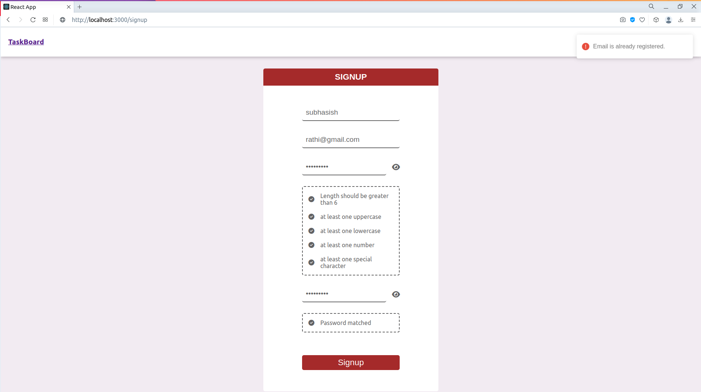
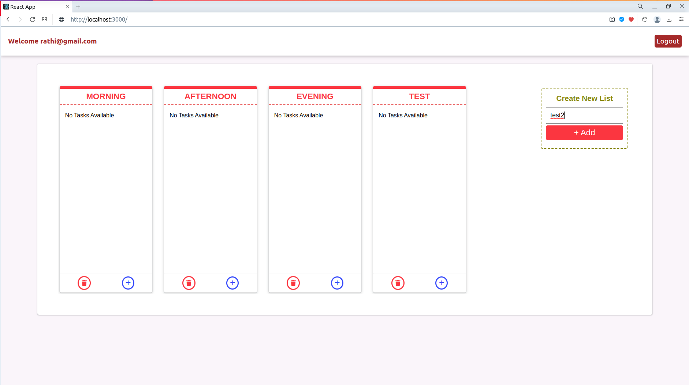

<h1 align="center">
Task Board Project (Kanban Board)
</h1>
<h6 align="center">A PERN Stack based web application.</h6>
<p align="center">
PostgreSQL, ExpressJS, React, NodeJS
</p>

> PERN is a fullstack implementation in PostgreSQL, Expressjs, React, Nodejs.
PERN stack is the idea of using Javascript/Node for fullstack web development.

<br>

> <b>Task Board</b> is a platform which help us to create account based boards and the tasks with the drag and drop functionality , just like kanban board etc. It is a fully responsive PERN based web application.

<br>

> A Kanban Board is an agile project management tool designed to help visualize work, limit work-in-progress, and maximize efficiency (or flow). It can help both agile and DevOps teams establish order in their daily work..
> <ul><li>Login</li><li>Signup</li><li>Explore Boards</li><li>Add the new board</li><li>Add different tasks in particular board</li><li>Drag and Drop tasks into different boards smoothly</li><li>Delete the board created</li><li>Delete the task created by cheking checkbox</li><li>You can not drag and drop the same task name exists in another board</li><li>Cannot add new board with already existed board</li><li>Can add many board as you want</li><li>Can add many tasks as you needed</li></ul><b>and much more via using 10+ APIs</b><br><strong>Screenshots of project is attached at the last section.</strong>


## clone or download
```terminal
$ git clone https://github.com/rathisubhasish/JOOGLE-Opportunity-hunting-Platform-.git
$ yarn # or npm i
```

# Usage (run fullstack app on your machine)

## Prerequisites
- PostgreSQL 
- [Node](https://nodejs.org/en/download/)
- [npm](https://nodejs.org/en/download/package-manager/)

notice, you need client and server runs concurrently in different terminal session, in order to make them talk to each other

## Client-side usage(PORT: 3000)

```terminal
//Pre-requisite for client to server connect
$ echo "REACT_APP_API_URL=http://localhost:YOUR_API_URL" >> src/.env
```

```terminal
$ cd client          // go to client folder
$ npm i    // npm install packages
$ npm start        // run it locally
```

## Server-side usage(PORT: 8000)

### Prepare your secret

run the script at the first level:

(You need to add a variables in .env to connect to MongoDB, port, JWT_SECRET)

```terminal
// in the root level
$ cd server
$ echo "JWT_SECRET=YOUR_JWT_SECRET" >> src/.env
$ echo "PORT=YOUR_PORT" >> src/.env
Edit config.js and enter your postgresql database details (username, password)
```
 
### Start

```terminal
$ cd server   // go to server folder
$ npm i       // npm install packages
$ npm start // run it locally
```

# Dependencies(tech-stacks)
Server-side | Client-side
--- | ---
bcrypt: ^5.1.1|dotenv: ^16.3.1
body-parser: ^1.20.2|react: ^18.2.0
cookie-parser: ^1.4.6|react-dom: ^18.2.0
cors: ^2.8.5|react-loading: ^2.0.3
dotenv: ^16.3.1|react-router-dom: ^6.18.0
express: ^4.18.2|react-scripts: 5.0.1
express-validator: ^5.3.1|react-toastify: ^9.1.3
jsonwebtoken: ^9.0.2|web-vitals: ^2.1.4
nodemon": ^3.0.1|:
pg: ^8.11.3|:
pg-hstore: ^2.3.4|:
sequelize: ^6.33.0|:


# Project Images (Mobile / Small Sceen View)

<h3>More Images are uploaded in Project_Images folder.</h3>


<hr />

<hr />

<hr />

<hr />

<hr />

<hr />

<hr />

<hr />

<hr />

<hr />

<hr />

<hr />

<hr />

<hr />

<hr />

<hr />

<hr />

<hr />

<hr />

<hr />

<hr />

<hr />

<hr />

<hr />

<hr />

<hr />

<hr />

<hr />

<hr />

<hr />

